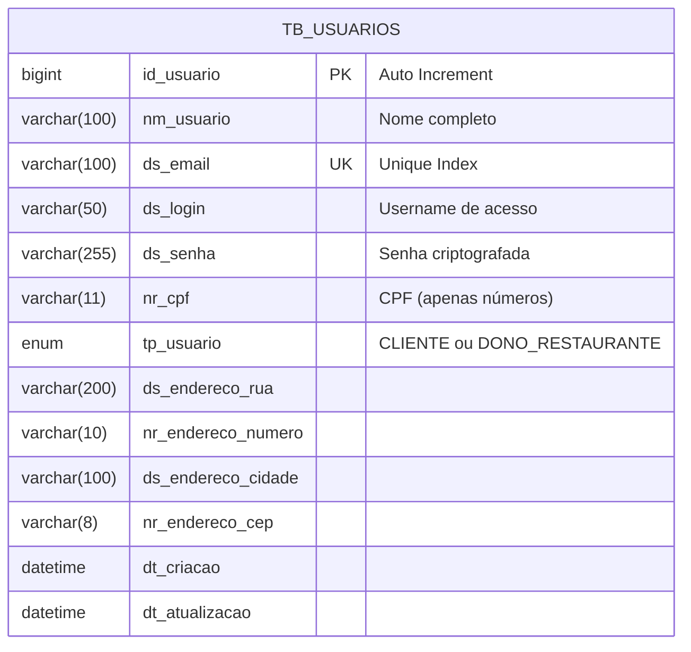

# 📄 Relatório Técnico - Tech Challenge Fase 1

Este documento detalha as decisões arquiteturais, modelagem e padrões adotados na implementação da Fase 1, servindo como evidência técnica para a avaliação do projeto.

---

## 1. Arquitetura e Design Patterns

O projeto segue uma arquitetura em camadas bem definida (MVC - Model View Controller no contexto Spring REST), fortemente baseada nos princípios **SOLID** para garantir testabilidade e manutenibilidade.

### Camadas e Responsabilidades

1.  **API Layer (`.api.controller`)**:
    *   **Responsabilidade**: Tratar requisições HTTP e retornar respostas adequadas.
    *   **Padrão**: RESTful.
    *   **SOLID (SRP)**: Controllers não contêm regras de negócio; apenas delegam para Services.

2.  **Service Layer (`.application.service`)**:
    *   **Responsabilidade**: Encapsular regras de negócio (Validações, Lógica).
    *   **Padrão**: DIP (Dependency Inversion Principle). A camada depende de abstrações (`UsuarioRepository` interface), não de implementações concretas de acesso a dados.
    *   **Padrão**: OCP (Open/Closed Principle). A interface `UsuarioService` define o contrato, permitindo que a implementação `UsuarioServiceImpl` evolua sem quebrar os clientes.

3.  **Domain Layer (`.domain`)**:
    *   **Responsabilidade**: Representar o núcleo do negócio.
    *   **Componentes**: Entidades JPA (`Usuario`) e Enums (`TipoUsuario`).
    *   **Isolamento**: As entidades não dependem de frameworks externos além de JPA/Hibernate.

4.  **Infrastructure Layer (`.infrastructure`)**:
    *   **Responsabilidade**: Configurações globais e tratamento de exceções.
    *   **Destaque**: `GlobalExceptionHandler` implementando **ProblemDetail (RFC 7807)**, garantindo erros padronizados e semânticos.

---

## 2. Modelagem de Dados (ERD)

A modelagem de dados foi implementada utilizando JPA e MySQL. Abaixo, o diagrama Entidade-Relacionamento da tabela `tb_usuarios`.



### Decisões de Modelagem:
*   **Snake Case**: Mapeamento objeto-relacional ajustado para snake_case no banco (`nome` -> `nm_usuario`), seguindo boas práticas de DBA.
*   **Constraints**:
    *   `UK_ds_email`: Garante unicidade de emails no nível do banco.
    *   `NOT NULL`: Aplicado em campos obrigatórios para integridade dos dados.
*   **Enums**: `tp_usuario` mapeado como String (`EnumType.STRING`) para legibilidade no banco.

---

## 3. API Endpoints e Padrões

A API segue o nível 2 do modelo de maturidade de Richardson (Verbos HTTP corretos).

### Principais Endpoints

| Método | Endpoint | Descrição | Status Sucesso |
|--------|----------|-----------|----------------|
| `POST` | `/v1/usuarios` | Cria novo usuário | `201 Created` |
| `GET` | `/v1/usuarios/{id}` | Busca usuário por ID | `200 OK` |
| `PUT` | `/v1/usuarios/{id}` | Atualiza dados cadastrais | `200 OK` |
| `PATCH` | `/v1/usuarios/{id}/senha` | Troca de senha (exclusivo) | `204 No Content` |
| `POST` | `/v1/usuarios/login` | Valida credenciais | `200 OK` |

### Tratamento de Erros (RFC 7807)

Erros não retornam apenas strings, mas objetos JSON estruturados:
```json
{
  "type": "https://api.techchallenge.com/errors/business-rule",
  "title": "Regra de negócio violada",
  "status": 422,
  "detail": "Email já cadastrado: joao@email.com",
  "timestamp": "2026-01-18T10:00:00Z"
}
```

---

## 4. Evidências de Qualidade (Desafio Extra)

Este projeto cumpre o requisito de **Desafio Extra** através de uma suíte de testes robusta.

### ✅ Cobertura de Testes
*   **Testes Unitários (`UsuarioServiceTest`)**: Isolam a regra de negócio usando **Mockito**. Cobrem 100% dos cenários de validação (email duplicado, busca inexistente, senha incorreta).
*   **Testes de Integração (`UsuarioControllerTest`)**: Validam a camada Web usando `@WebMvcTest`. Garantem que os endpoints retornam os status codes corretos (404, 422, 201).
*   **Frameworks**: JUnit 5, Mockito.

### ✅ Validação de Dados
Uso extensivo de **Bean Validation** (`@Valid`, `@NotBlank`, `@Email`, `@Size`) nos DTOs, garantindo que dados inválidos sejam rejeitados antes mesmo de chegar à camada de serviço.

---

## 5. Guia de Execução Docker

O projeto utiliza Docker Compose para orquestração.

### Arquivo `docker-compose.yml`

*   **Serviço `app`**:
    *   Portas: `8080:8080` (API), `5005:5005` (Debug Remoto).
    *   Volume: Bind mount `.` para hot-reload em desenvolvimento.
    *   Build: Multi-stage (Maven -> JRE Alpine).
*   **Serviço `database`**:
    *   Imagem: `mysql:8.4`.
    *   Porta: `3306` (Interna).
    *   Dados persistentes: Volume `mysql_data`.

### Como Executar

Simplesmente execute na raiz do projeto:

```bash
docker compose up --build
```

A aplicação estará pronta quando visualizar o log: `Started TechChallengeApplication in ... seconds`.
