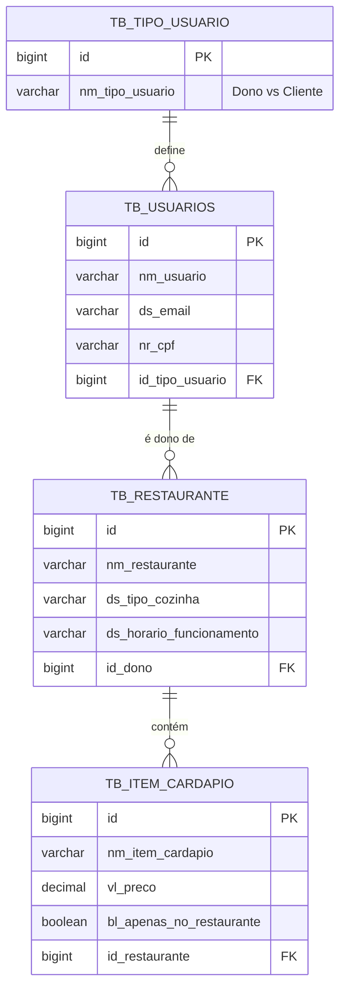

# 📄 Relatório Técnico - Tech Challenge Fase 2

Este documento detalha as decisões arquiteturais, modelagem e padrões adotados na implementação da Fase 2, focada na evolução para **Clean Architecture** e na expansão do domínio do sistema de gestão de restaurantes.

Vídeo de apresentação: foi enviado em pasta zipada, juntamente ao relatório técnico, devido ao tamanho exceder o limite de upload no GitHub.

---

## 1. Arquitetura: Evolução para Clean Architecture

Nesta fase, o projeto foi refatorado de um padrão MVC tradicional para **Clean Architecture (Arquitetura Limpa)**. O objetivo é desacoplar o núcleo de negócio de frameworks e detalhes de infraestrutura.

### Camadas e Responsabilidades

1.  **Domain Layer (`com.fiap.techchallenge.domain`)**:
    *   **Entidades**: Contém o "Enterprise Business Rules" (`User`, `Restaurant`, `MenuItem`, `UserType`).
    *   **Independência**: Não possui dependências de bibliotecas externas (nem JPA). As entidades são POJOs puros com lógica de negócio intrínseca.

2.  **Application Layer (`com.fiap.techchallenge.application`)**:
    *   **Use Cases**: Implementa os "Application Business Rules". Cada operação (ex: `CreateRestaurantUseCase`) é um caso de uso isolado.
    *   **Gateways (Interfaces)**: Define os contratos de persistência que a infraestrutura deve seguir (Inversão de Dependência).
    *   **DTOs**: Objetos de transferência de dados para entrada e saída.

3.  **Infrastructure Layer (`com.fiap.techchallenge.infrastructure`)**:
    *   **Persistence**: Implementa os Gateways usando Spring Data JPA e Hibernate.
    *   **Configuration**: Define os Beans do Spring para injetar Use Cases (os Use Cases não usam `@Service` para manter a pureza).
    *   **Controllers**: Adaptadores que convertem requisições HTTP em chamadas aos Use Cases.

---

## 2. Modelagem de Dados Ampliada

O modelo foi expandido para suportar o fluxo completo de gestão.

### Diagrama Entidade-Relacionamento (ERD)

```mermaid
erDiagram
    TB_TIPO_USUARIO ||--o{ TB_USUARIOS : "define"
    TB_USUARIOS ||--o{ TB_RESTAURANTE : "é dono de"
    TB_RESTAURANTE ||--o{ TB_ITEM_CARDAPIO : "contém"

    TB_TIPO_USUARIO {
        bigint id PK
        varchar nm_tipo_usuario "Dono vs Cliente"
    }

    TB_USUARIOS {
        bigint id PK
        varchar nm_usuario
        varchar ds_email
        varchar nr_cpf
        bigint id_tipo_usuario FK
    }

    TB_RESTAURANTE {
        bigint id PK
        varchar nm_restaurante
        varchar ds_tipo_cozinha
        varchar ds_horario_funcionamento
        bigint id_dono FK
    }

    TB_ITEM_CARDAPIO {
        bigint id PK
        varchar nm_item_cardapio
        decimal vl_preco
        boolean bl_apenas_no_restaurante
        bigint id_restaurante FK
    }
```

### Decisões Técnicas:
*   **Flyway**: Todas as alterações de schema (criação de novas tabelas e FKs) são gerenciadas via migrations (`src/main/resources/db/migration`), garantindo versionamento do banco.
*   **Audit**: Todas as tabelas principais possuem `dt_criacao` e `dt_atualizacao`.

---

## 3. API Endpoints (Versionamento /v1)

A API foi padronizada e expandida.

| Entidade | Base Path | Operações Disponíveis |
|----------|-----------|------------------------|
| **Tipos de Usuário** | `/v1/user-types` | CRUD Completo |
| **Usuários** | `/v1/users` | CRUD + Login + Troca Senha |
| **Restaurantes** | `/v1/restaurants` | CRUD Completo |
| **Itens do Cardápio**| `/v1/menu-items` | CRUD Completo |

---

## 4. Garantia de Qualidade e Testes

O projeto atingiu um alto nível de maturidade técnica através de testes automatizados.

### Cobertura e Métricas
- **Meta Auditada**: >80% de cobertura instruction/branch nas camadas de **Domínio** e **Aplicação**.
- **Resultado Final**:
  - `UserType`: 98%
  - `MenuItem`: 88.8%
  - `User`: 87.4%
  - `Restaurant`: 99%
- **Volume**: **131 testes automatizados** executados com sucesso.

### Práticas SOLID Aplicadas
- **SRP**: Cada Use Case foca em uma única funcionalidade.
- **DIP**: A camada de Aplicação depende de interfaces de Gateway, não do JPA diretamente.
- **ISP**: Interfaces de Gateway granulares por domínio.

---

## 5. Infraestrutura Moderna (Docker)

O ambiente foi Dockerizado com suporte a perfis de execução:

- **Perfil `prod`**: Imagem otimizada (JRE Alpine), focada em performance e segurança.
- **Perfil `dev`**: Habilita ferramentas de build, hot-reload (Spring DevTools) e debug remoto (porta 5005).
- **Orquestração**: O `docker-compose.yml` agora utiliza **Healthchecks** para garantir que a aplicação só inicie após o MySQL estar pronto para conexões.

---
